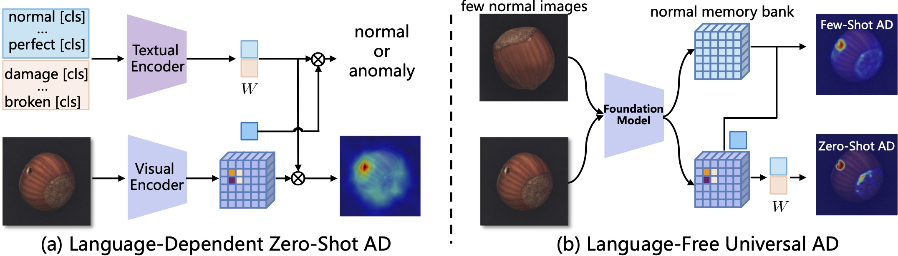
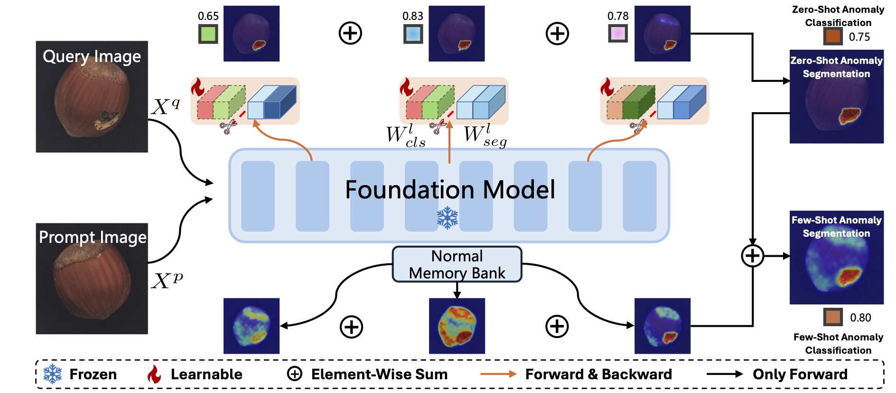

# UniADet

> Official PyTorch Implementation of [One Language-Free Foundation Model Is Enough for Universal Vision Anomaly Detection](https://arxiv.org/abs/2601.05552), 2026.

- [“我爱计算机视觉”中文解读](https://mp.weixin.qq.com/s/AoMRcYMdJmAb355pzoPbhQ)
- ["木迅"中文解读](https://mp.weixin.qq.com/s/AljAi1wMlhSi954HQE86nQ)

## Introduction 
UniADet is a **language-free** universal (Zero- and Few-shot) visual anomaly detection framework.  It achieves superior performance outperforming state-of-the-art **language-dependent** Zero- and Few-shot AD models while also exhibiting remarkable simplicity and efficiency.

<div align="center">
    
</div>

- We rethink vision-language ADs and find that language prompts and encoders are unnecessary. This insight leads to an embarrassingly **simple**, **parameter-efficient**, **general**, and **effective** framework for universal anomaly detection.
- We fully **decouple global anomaly classification and local anomaly segmentation** across multi-scale hierarchical features, effectively mitigating the learning conflict between different feature manifolds and substantially improving AD performance.
- Comprehensive experiments conclusively validate that our approach achieves **state-of-the-art zero-shot and few-shot performance**. Notably, our few-shot UniADet is **the first** to outperform full-shot state-of-the-art.

## UniADet Framework

<div align="center">
    
</div>


## Comparison with State-of-the-Arts

| Methods | Venue | Language-Free | Shots | MVTec | VisA  | Real-IAD |
| :--- | :---: |  :---: | :---: | :--- | :--- | :--- |
| **UniADet** $^‡$ | ours| ✓ |0 | **93.5  / 50.9** | **91.3 / 32.7** | **82.5 / 43.1** |
| [WinCLIP](https://github.com/zqhang/Accurate-WinCLIP-pytorch) | CVPR 23 | ✗ | 0 | 90.4 / 18.2 | 75.5 / 5.4 | 67.0 / 3.3 |
| [APRIL-GAN](https://github.com/ByChelsea/VAND-APRIL-GAN) | CVPRW 23 | ✗ | 0 | 86.1 / - | 78.0 / - | - | -|
| [AnomalyCLIP](https://github.com/zqhang/AnomalyCLIP) | ICLR 24 | ✗ | 0 | 91.6 / 34.5 | 82.0 / 21.3 | 69.5 / 26.7 |
| [AdaCLIP](https://github.com/caoyunkang/AdaCLIP) | ECCV 24 | ✗ | 0 | 90.7 / 39.1 |  81.7 / 31.0 | 73.3 / 30.5 |
| [VCPCLIP](https://github.com/xiaozhen228/VCP-CLIP) | ECCV 24| ✗ | 0 | 92.1 / 49.4 | 83.8 / 30.1 | - |
| [Bayes-PFL](https://github.com/xiaozhen228/Bayes-PFL) | CVPR 25| ✗ | 0 |92.5 / 48.3 | 87.0 / 29.8 | 70.0 / 27.6| 
| [AA-CLIP](https://github.com/Mwxinnn/AA-CLIP) | CVPR 25 | ✗ | 0 | 90.5 / - | 84.6 / - | -|
| [FE-CLIP](https://openaccess.thecvf.com/content/ICCV2025/papers/Gong_FE-CLIP_Frequency_Enhanced_CLIP_Model_for_Zero-Shot_Anomaly_Detection_and_ICCV_2025_paper.pdf)   | ICCV 25 | ✗ | 0 | 91.9 / - | 84.6 / - | -|
| [FAPrompt](https://github.com/mala-lab/FAPrompt) | ICCV 25 | ✗ | 0 | 91.9 / - | 84.6 / - | -|
| [RareCLIP](https://github.com/hjf02/RareCLIP) | ICCV 25 | ✗ | 0 |91.5 / 46.1 | 86.1 / 27.0 | - |
| [AdaptCLIP](https://github.com/gaobb/AdaptCLIP) |AAAI 26  | ✗ | 0 | 93.5 / 38.3 | 84.8 / 26.1 | 74.2 / 28.2 |


| Methods | Venue | Language-Free | Shots | MVTec | VisA  | Real-IAD |
| :--- | :---: |  :---: | :---: | :--- | :--- | :--- |
| **UniADet** $^‡$ | ours | ✓ | 1 | 97.6 / 63.1 | 95.2 / 42.1 | 88.7 / 48.4 |
| **UniADet** $^‡$ | ours| ✓ | 2 | 98.0 / 64.1 | 96.1 / 44.2 | 89.0 / 46.7 |
| **UniADet** $^‡$ | ours| ✓ | 4 | **98.7 / 65.4** | **96.9 / 45.2** | **90.3 / 48.5** |
| [MetaUAS](https://github.com/gaobb/MetaUAS) |NeurIPS 24 | ✓ | 1 | 90.7 / 59.3 | 81.2 / 42.7 | 80.0 / 36.6 |
| [APRIL-GAN](https://github.com/ByChelsea/VAND-APRIL-GAN) | CVPRW 23 | ✗ | 4 | 92.8 / 54.5 | 92.6 / 32.2 | -|
| [PromptAD](https://github.com/FuNz-0/PromptAD) | CVPR 24 | ✗ | 4 | 96.6 / 52.9 | 89.1 / 31.5 | - |
| [UniVAD](https://github.com/FantasticGNU/UniVAD) |CVPR 25  | ✗ | 1 | 97.8 / 55.6 | 93.5 / 42.8 | 85.1 / 37.6 |
| [AdaptCLIP](https://github.com/gaobb/AdaptCLIP) |AAAI 26  | ✗ | 1 | 94.5 / 53.7 | 90.5 / 38.9 | 81.8 / 36.6 |
|  [AdaptCLIP](https://github.com/gaobb/AdaptCLIP) |AAAI 26  | ✗ |2 | 95.7 / 55.1 | 92.2 / 40.7 | 82.9 / 37.8 |
|  [AdaptCLIP](https://github.com/gaobb/AdaptCLIP) |AAAI 26  | ✗ |4 | 96.6 / 57.2 | 93.1 / 41.8 | 83.9 / 39.1 |
| [Dinomaly](https://github.com/guojiajeremy/Dinomaly) |CVPR 25  | ✓ | full | 99.6 / 69.3 | 98.7 / 53.2 | 89.3 / 42.8 |
| [UniAD](https://github.com/zhiyuanyou/UniAD) |NeurIPS 24| ✓ |full | 96.5 / 44.7 | 90.8 / 33.6 | 83.0 / 21.1 |

Note1: The performance is mesured by Image-AUROC / Pixel-AUPR.

Note2: If you find that any existing zero-shot/few-shot AD methods are missing from the table above, please feel free to open an issue so we can add them.

## Complexity and Efficiency Comparisons

| Shots | Methods | Models | Input Size | # Params (M) | Inf. Time (ms) |
| :--- | :--- | :--- | :--- | :--- | :--- |
| **0** | AdaCLIP | CLIP ViT-L/14@336px | 518×518 | 428.8 + 1.1e+1 | 107.4 |
| **0** | AnomalyCLIP | CLIP ViT-L/14@336px | 518×518 | 427.9 + 5.6e+0 | 70.7 |
| **0** | Bayes-PFL | CLIP ViT-L/14@336px | 518×518 | 427.9 + 2.7e+1 | 154.9 |
| **0** | AdaptCLIP-Zero | CLIP ViT-L/14@336px | 518×518 | 427.9 + 6.0e-1 | 57.5 |
| **0** | **UniADet** $^†$  | CLIP ViT-L/14@336px | 518×518 | **342.9 + 1.5e-2** | **15.7** |
| **0** | **UniADet** $^‡$ | DINOv2 ViT-L/14 | 518×518 | **303.2 + 2.0e-2** | **41.9** |
| **1** | InCtrl | CLIP ViT-B-16+240 | 240×240 | 208.4 + 3.0e-1 | 59.0 |
| **1** | AnomalyCLIP+ | CLIP ViT-L/14@336px | 518×518 | 427.9 + 5.6e+0 | 76.2 |
| **1** | AdaptCLIP | CLIP ViT-L/14@336px | 518×518 | 342.9 + 1.8e+0 | 58.7 |
| **1** | **UniADet** $^†$ | CLIP ViT-L/14@336px | 518×518 | **342.9 + 1.5e-2** | **22.4** |
| **1** | **UniADet** $^‡$ | DINOv2 ViT-L/14 | 518×518 | **303.2 + 2.0e-2** | **48.4** |

Note: The number of learnable parameters (**1.5e-3** and **2.0e-3**) is not correct for our UniADet $^†$ and UniADet $^‡$, respectively. The correct is **1.5e-2** and **2.0e-2** for UniADet $^†$ and UniADet $^‡$, respectively.

## Ablation Studies
Ablation studies about different components.
| No | DCS| DHF| CAA | Shot | MVTec  | VisA  |
| :-- | :--: | :--: | :--: | :--: | :-- | :-- |
| 0 | ✗ | ✗ | ✗ |  0 | 85.4 / 36.4 | 77.9 / 26.1 |
| 1 | ✓ | ✗ | ✗ |  0 | 91.8 / 38.3 | 85.9 / 27.2 |
| 2 | ✓ | ✓ | ✗ |  0 | 92.2 / 40.7 | 86.0 / 27.6 |
| 3 | ✓ | ✓ | ✓ |  0 | 92.4 / 42.8 | 88.0 / 28.0 |
| 4 | ✓ | ✓ | random |  0 | 91.3 / 41.5 | 87.5 / 26.6 |
| 5 | ✓ | ✓ | ✓ |  1 | **95.9 / 54.6** | **91.3 / 32.5** |

Note: The ablation studies are conducted by UniADet $^†$ (i.e., using CLIP ViT-L/14@336px).


## ToDo List
- [ ] release pre-trained [UniADet models]()
- [ ] deploy [online UniADet Demo]() on huggingface
- [ ] open training and testing code


## Citation
If you find this work useful in your research, please consider citing:
```
@inproceedings{uniadet,
  title={One Language-Free Foundation Model Is Enough for Universal Vision Anomaly Detection},
  author={Gao, Bin-Bin and Wang, Chengjie},
  booktitle={arXiv:2601.05552},
  year={2026}
}
```

## Star History

[](https://www.star-history.com/#gaobb/UniADet&type=timeline&legend=top-left)
